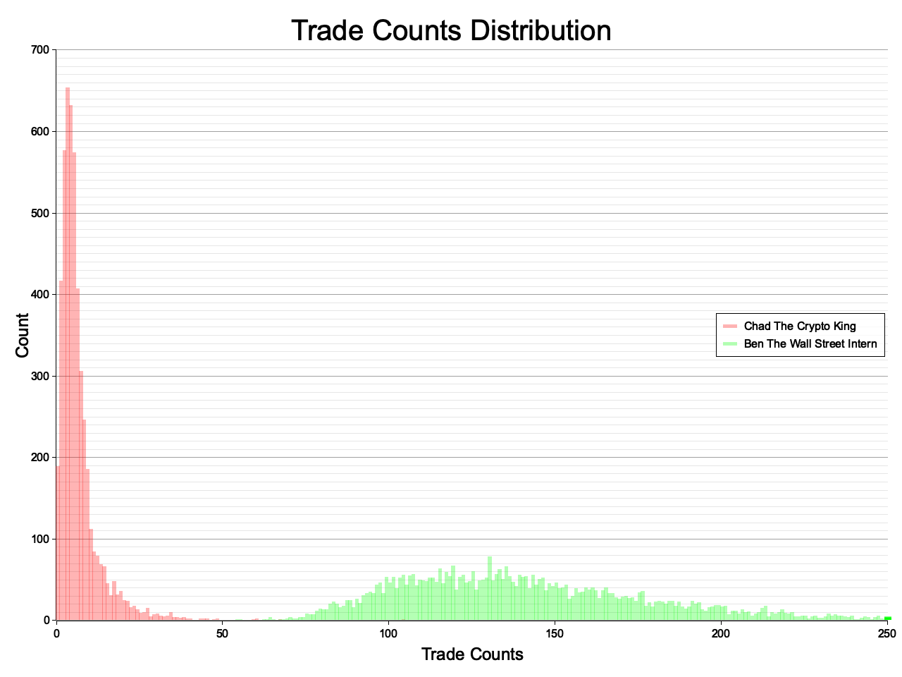

# bro-market

`bro-market` is a satire project that aims to point out the common trading fallacies in the stock market. It is a simple
Monte Carlo simulation of a stock market with independent agents, where agents buy/sell stocks depending on their
trading strategies (signals), while the stocks move completely randomly.

## Table of Contents

1. [Setup](#setup)
2. [Market Rules](#market-rules)
3. [Results](#results)
4. [Conclusions](#conclusions)

## Setup

```bash
curl https://sh.rustup.rs -sSf | sh
cargo build --release
```

To run the Monte Carlo simulation or to display the statistics, run:

```bash
target/release/mc # Will take a bit
target/release/stats
```

## Market Rules

The market is defined by these rules:

- The market is infinitely liquid, meaning that the agent can buy and sell stocks at any time, without affecting the
  price.
- The market is composed of a set of 5 stocks, each with the same starting price, that are not correlated with each
  other.
- The stock prices change randomly each hour, by a **uniformly**-random amount between **-1% and +1%**.
- The market consists of two independent agents, **"Chad The Crypto King"** and **"Ben The Wall Street Intern"**.
- If an agent detects an instrument buy signal, he will buy the instrument stocks with 40% of his total cash.
- If an agent detects an instrument sell signal, he will panic and sell all his stocks for that particular instrument.
- **"Chad The Crypto King"**
  uses [head and shoulders bottom pattern](https://en.wikipedia.org/wiki/Head_and_shoulders_(chart_pattern)#Head_and_shoulders_bottom)
  to detect buy signals
  and [head and shoulders top pattern](https://en.wikipedia.org/wiki/Head_and_shoulders_(chart_pattern)#Head_and_shoulders_top)
  to detect sell signals.
- **"Ben The Wall Street Intern"**
  uses [double-bottom pattern](https://en.wikipedia.org/wiki/Double_top_and_double_bottom#Double_bottom) to detect buy
  signals and [double-top pattern](https://en.wikipedia.org/wiki/Double_top_and_double_bottom#Double_top) to detect sell
  signals.
- Each trade costs **0.5%** of the total value of the transaction.
- The agents start with **10000 USD** each.
- The market is open 24/7.

The Monte Carlo simulations run for **24000 hours** each, and in total, there are 5000 simulations.

## Results




```
+-----------------------+----------------------+----------------------------+
| Simulation Statistics | Chad The Crypto King | Ben The Wall Street Intern |
+-----------------------+----------------------+----------------------------+
| Net avg.              | 9887.12 ± 4261.77    | 9197.62 ± 5254.77          |
+-----------------------+----------------------+----------------------------+
| Trade count avg       | 6.22 ± 6.29          | 142.38 ± 41.32             |
+-----------------------+----------------------+----------------------------+
| Avg. profit           | -1.13%               | -8.02%                     |
+-----------------------+----------------------+----------------------------+
| Profit p              | 36.24%               | 33.74%                     |
+-----------------------+----------------------+----------------------------+
| >2x p                 | 2.82%                | 3.30%                      |
+-----------------------+----------------------+----------------------------+
| >3x p                 | 0.46%                | 0.76%                      |
+-----------------------+----------------------+----------------------------+
| >5x p                 | 0.06%                | 0.10%                      |
+-----------------------+----------------------+----------------------------+
```

## Conclusions

At the first sight - the results are quite obvious. **"Chad The Crypto King"** and "Ben The Wall Street
Intern" are complete failures. They both lose money, and they both lose it fast.

But jokes aside, let's look a bit deeper. It was quite expected, that the average networth of the agents will have
experienced negative gains, since the stocks move randomly and there is a trade cost. But with this simulation,
I wanted to look at different aspects:

- Probability of randomly getting positive gains;
- The fact that these popular/"established" trading patterns can happen by random;

As there is not much to add to the second point, let's focus on the first one. While on average bros lost money - some
of them got quite lucky. **2.82%** of the simulations resulted in Chad getting more than **2x** returns. For **>5x**
returns, the probability is **0.06%** and **0.10%** for Chad and Ben respectively. If this
simulation used ten million agents (approx. to real market) instead of two - we would have **6000** Chads
and **10000** interns packing five-baggers. That's a lot of people making money in the stock market just by
random. And the problem is - due to survivorship bias, we only hear about the Chads and the Bens, and not about the
millions of other people who lost money.

So the next time you hear about some super-star trader in social media, who made 500% returns in a year - assume that
he/she is a scammer. And given the small probability that the person is not a scammer, maybe he/she just got really
lucky. So don't feel pressured to buy Rivian nr. 2 or some to-the-moon coins. Just relax and enjoy the ride.
